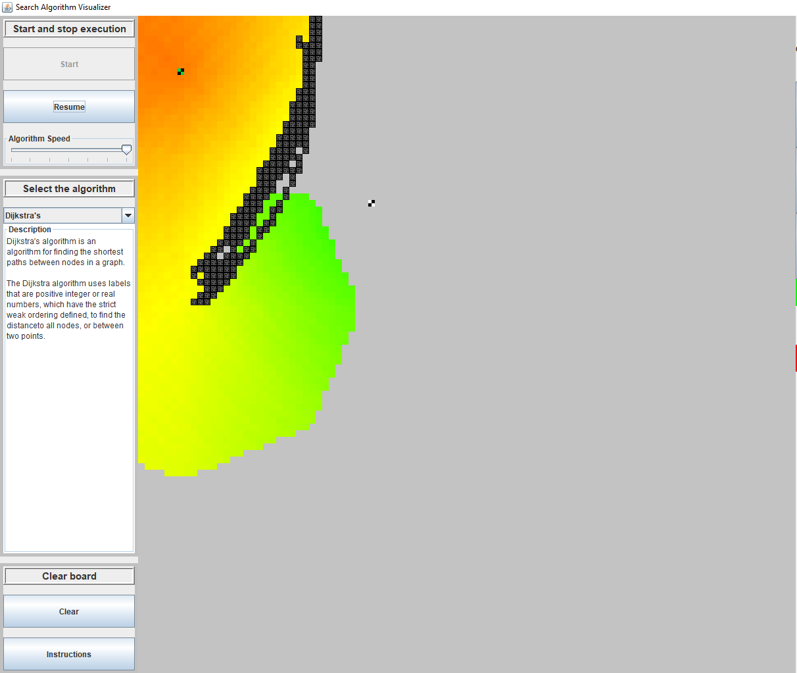
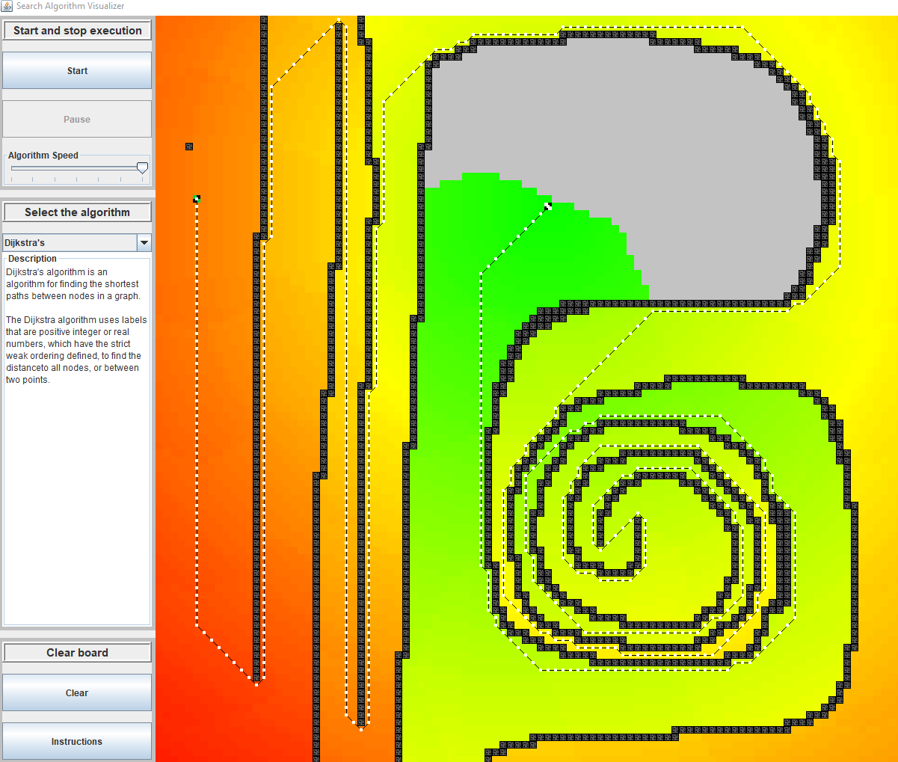

# Search-Algorithm-Visualizer
Simple visualizer tool for showing how common search algorithms propogate

This project was a labour of love with the goal of learning Java Swing and the EDT, general concurrency programming, and to learn about 
search algorithms overall. I also learnt how much there is to know on these topics!

The tool allows you to select a source, and optionally a target (depending on the algorithm) on a 1000x1000 grid. You can then block 
whatever positions on the grid you like, to make the path finding more interesting.

The algorithm will then search then graph, and push updates the the view, which will show each searched square coloured according to
it's approximate closeness to the target (or simply distance from source if no target shown). When the algorithm finishes, it will draw 
node-and-line path from the source to the end point - either the target or the furthest possible distance travelled:

Dependencies:

Algorithms (WatsonMC/Algorithms) 
Currently, the SAV utilises only Djirskas search from this repo. The goal is to more tightly define the UndirectedUnewightedGraph and 
UpdatingSearchAlgorithm interfaces so that this dependency can be removed. This will be done once I've implemented all the search 
algorithms I would like. 

Data Structures (WatsonMC/Algorithms)
Mostly being utilised since I had it lying around from a previous project (OCW 6.005). This should be superseded by JGraphT eventually. 

